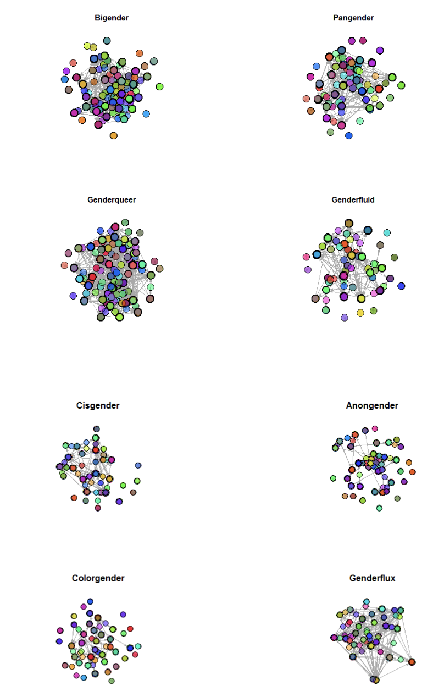
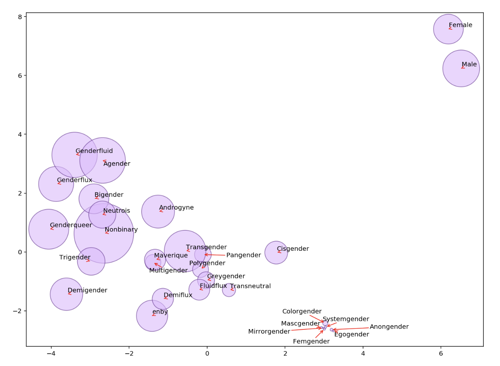
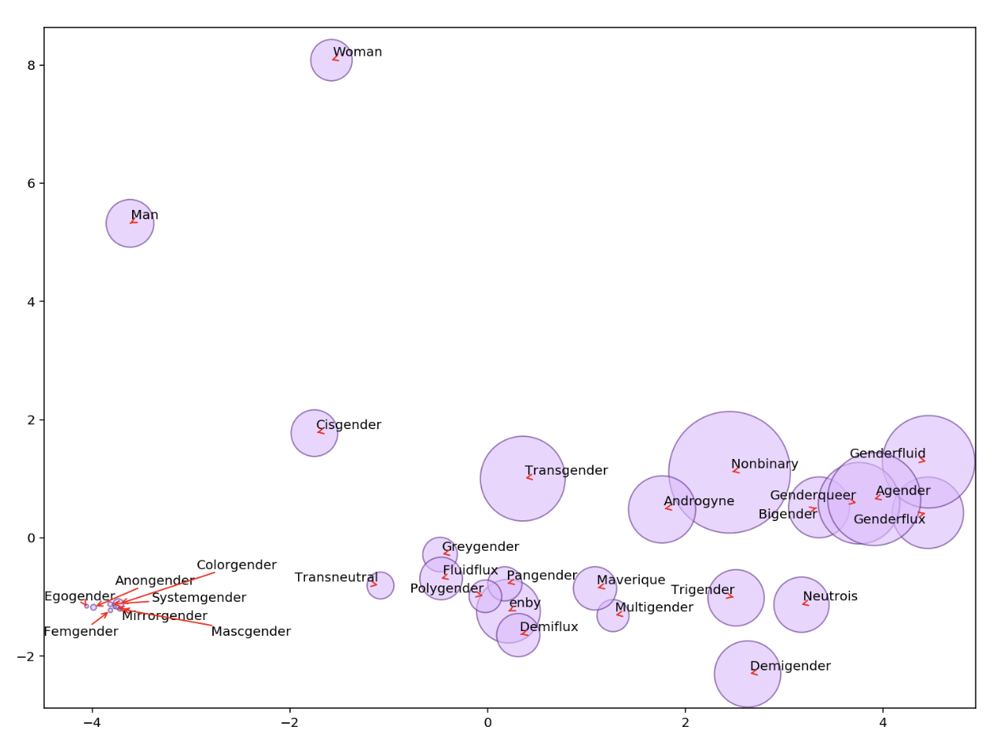
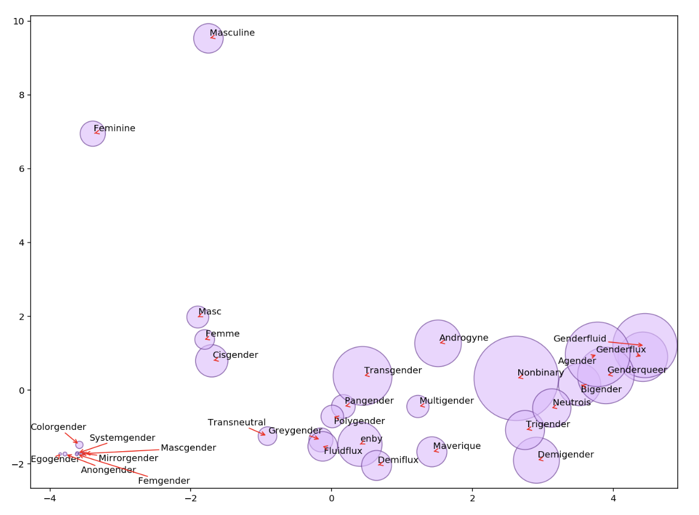

# gender-on-tumblr

## Digital Gender Diversity: Constellations of Gendered Meaning on Tumblr

Hannah Curtis1 and Ian Kennedy1*
1University of Washington, Sociology Department
*Authors Contributed equally to research and writing and are listed in alphabetical order and by last name
Abstract
Using an innovative double sample of Gender-focused discursive communities on Tumblr, we investigate how diverse genders are produced, performed, and discussed. Contemporary sociological work on gender remains bound by binary gender thinking, even when focused on gender diverse individuals and communities. That work amounts to an interrogation of non-binary, trans, and other gender diverse and queer people. Scholars then attempt to define our genders in terms of men and women, often placing us either between man and woman or by measuring our opposition to that binary. Results from discussions on tumblr reject this accounting. We use network analysis to show that individual gender networks are connected and have similar density scores . In many cases, the same vertices  were shared between multiple networks, demonstrating that if Tumblr users were participating in one diverse gender network, they were likely to be embedded in several others. Together, these findings indicate that Tumblr users do not limit their participation to a singular gender network. Instead, they consider a multiplicity of gender networks when using Tumblr signifying that conversations about gender identity are layered, relational, and dynamic.  Word embeddings, a way of measuring the way words are used, show that words reflecting gender-diverse identities form their own constellation of meaning neither between nor in opposition to ‘man’ and ‘woman’. 

## Paper Excerpt:

### INTER-NETWORK CHARACTERISTICS: 
Vertex overlap was present between all networks. For most networks, simultaneous node count increased if intersecting two diverse gender identity tags as opposed to intersecting any diverse gender tag with the cisgender tag. Tumblr users utilizing large networked diverse gender tags were not participating in the cisgender tag network as frequently as with other diverse gender tags. Many nodes were poly connected to several networks. This finding demonstrates that if Tumblr users were present in a large network comprised of a diverse gender tag, they were likely to be participating in other large networks comprised of different diverse gender tags. Smaller networks had less shared nodes across networks in general. As can be seen in Table 3, the networks produced from tags “Trigender”, “Anongender”, and “Egogender” actually had more shared nodes with the “Cisgender” network. However, size does not fully explain this relationship as “Anongender” has twice as many nodes compared to “Trigender” and “Egogender”. A possibility is that these three gender networks are less common in the Tumblr discourse, and therefore less connected to gender networks that are more common in the Tumblr discourse. Further tests should be completed to identify unique characteristics between the networks and their propensity to share nodes with other diverse gender tag networks. 

Table 3. Sample of Overlapping Vertices Between Cisgender and Genderfluid Networks
Relationship
Count of Shared Nodes
Relationship
Count of Shared Nodes
Cisgender-Nonbinary
286
Genderfluid-Nonbinary
1061
Cisgender-Trigender
432
Genderfluid-Trigender
252
Cisgender-Genderqueer
310
Genderfluid-Genderqueer
917
Cisgender-Genderflux
237
Genderfluid-Genderflux
479
Cisgender-Anongender
60
Genderfluid-Anongender
49
Cisgender-Egogender
44
Genderfluid-Egogender
40

**Figure 1: Intra-Gender Like Network**

### PCA Analysis

The results of the word2vec word embeddings analysis on Sample 2 of 16,426 posts scraped on January 12, 2020 suggests that not only are diverse gender identities not used on a ‘gender dimension’ between masculinity and femininity, but that use of diverse gender identifications seems to represent a distinct linguistic space that does not take binary gender as a primary referent. Instead, we find that discourse surrounding diverse genders on tumblr reflects a separate constellation of meanings surrounding gender.

**Figure 2: t-SNE PCA Plot of the Top 30 Gender Identities from our Scraped List**

_Relative location represents linguistic similarity, circle size represents number of occurrences in our corpus, where common words have larger circles_

Figure 2 shows the t-SNE PCA plot of our original list of 30 genders, derived from the list pulled from a tumblr post and selected based on their popularity on the platform. Contrary to expectations that gender diverse terms would be defined in terms of or in opposition to binary gender, those terms seem to take up a distant linguistic space compared to ‘Male’ and ‘Female’. Notably, ‘Cisgender’ is much more similar in use to gender diverse terms than ‘Male’ and ‘Female’ are, likely reflecting its statsus as an alternative to gender diverse terms. This makes sense: a trans woman is a woman, her gender is not (necessarily) in opposition to binary gender, but it is distinct from cisgenderness (see figure 5). 
There are two possible easy critiques of this plot. First, ‘Male’ and ‘Female’ do seem to vary mostly on a single dimension (the y axis), and second, ‘Man’ and ‘Woman’ are better analogs for the other gender terms. To the first point, it’s true that the binary genders seem to different across the y-axis, but interpreting higher values of y as being more female does not seem to make sense among the gender diverse terms. Why, for instance, would ‘Nonbinary’ be more ‘female’ than ‘Enby’? Instead, it seems like these axes are picking up on some other aspect of gender discourse. For the second objection, we can re-make the plot using ‘Man’ and ‘Woman’, as in figure 2.

**Figure 3: t-SNE PCA Replacing ‘Male’ and ‘Female’ with ‘Man’ and ‘Woman’**

Relative location represents linguistic similarity, circle size represents number of occurrences in our corpus, where common words have larger circles
In terms of relative distance between terms, Figures 2 and 3 generally agree. In our corpus, the relationship between gender binary and gender diverse terms does not seem to be based on binary conceptions of gender. Instead, as in Figure 2, gender diverse terms form their own constellation of meaning. We investigate a possible mechanism for this in Figure 4.

**Figure 4: t-SNE PCA Replacing ‘Male’ and ‘Female’ with ‘Masculine’ and ‘Feminine’ and ‘Masc’ and ‘Femme’**

*Relative location represents linguistic similarity, circle size represents number of occurrences in our corpus, where common words have larger circles*
As mentioned above, past sociological work has treated the relationship between the words ‘male’ and ‘female’ as a “gender dimension” which is measured in masculinity and femininity (Kozlowski et. al. 2019, 912). Seeking to investigate this association, we add the terms ‘Masculine’ and ‘Feminine’ as well as the terms ‘Masc’ and ‘Femme’. The relationship between  ‘Masculine’ and ‘Feminine’ together and the gender diverse terms seems to be similar to the relationship with ‘Man’ and ‘Woman’ in Figure 3, except that where in Figure 3 ‘Man’ was closer to the gender diverse constellation, here ‘Feminine’ is closer. Also, the terms ‘Masc’ and ‘Femme’, common in queer discourse, are both much closer to each other and to the gender diverse terms. This suggests the possibility that gender diverse constellation is, for lack of a better term, a queer lingusitic space.
**Figure 5: t-SNE PCA Including All Alternatives**

_Relative location represents linguistic similarity, circle size represents number of occurrences in our corpus, where common words have larger circles_
Including all of the terms investigated so far in a single PCA, Figure 5, further undermines the idea that ‘Man’ and ‘Woman’ create a ‘gender dimension’ which can be thought of in terms of femininity--at least in this corpus. We see that the direction of difference between ‘Man’ and ‘Woman’ seems to be the opposite of ‘Masculine’ and ‘Feminine.’ Thinking in terms of meaning-as-use, these results suggest that discourse about gender diverse identities on tumblr produces meanings that are separate from, not in terms of, binary genders. Moreover, the association with ‘Masc’ and ‘Femme’ suggests that this constellation of meaning is a queer one.

### Discussion
Our results show that, instead of being defined in terms of binary gender identities, gender diverse discourse on tumblr forms its own constellations of meaning. Conversations within particular identities happen in connected networks with varying densities. Users were embedded in multiple networks of particular identities, perhaps indicating that aspects of the production of gender on Tumblr are relational to one another.  Word embeddings show that the relational meaning of diverse gender identities in these conversations form in a queer discursive space that both does not map on to the gender binary but is neither defined in terms of its opposition to that binary. 
The implications of these findings are primarily to push scholars to take gender diverse people at our own word on our identification and relationship to binary genders. All of us have been constantly exposed to, to paraphrase bell hooks,  a hetero-patriarcal, White supremacist, capitalist, colonial, military-industrial complex which has constantly, and is still constantly, fighting for control of our identies. Our epistemological, as well as our political, responses to that assault are varied, and this project only describes, somewhat thinly, common constellations of meaning within the slice of tumblr we investigated. 
So when we report findings that people with shared identities are densely connected and that their discussions of those identities tend not to be in terms of binary genders, we are emphatically not saying that diverse gender discursive space is not ALSO connected to cisgender not-queer people. Nor are we suggesting that people do not (or should not) discuss, identify, or define their gender in terms of any particular binary. Instead, we are arguing that, partially because of its structural particularites, but mostly because of the flare of its users, gender discourse on tumblr offers a resistant space where thinking diverse gender becomes easy to think and easy to say, regardless of reference to the binary.
Reflexivity
Ian did the web scraping and the word embeddings analysis and wrote up the sections for those parts, as well as the abstract and some of the discussion. They have really been enjoying the project, especially reading lots of tumblrs and posts during the scraping process. They were really surprised by how much fun positivity about gender diversity there is on tumblr (though it is not all rainbows and pride-flag pokémon). Working with Hannah has been a blast, and they are in awe of the beautifully written introduction and theory sections. Working on the project as a white, non-binary but somewhat male presenting and often worried about if they are a queer enough person was interesting. They think that their whiteness influenced the project in the sense that it does not focus as much as it might on intersections with (especially) race, which often came up in posts they saw while scraping. They want to put more effort into leveraging these and other methods to show those tensions on tumblr. Similarly they are a hard believer in the necessary pairing of computational text analysis with lots and lots of deep reading and (more) traditional discourse analysis (like in Recuber 2017). That such analysis is absent from the current draft makes them sad. However, for Ian, this project began when they read an academic paper which seemed to force non-binary identity into a particular relationship with binary genders. 
Hannah did the descriptive network analysis, wrote up the respective results, wrote the front-end of the paper, and contributed to the discussion. Hannah has been a long-time Tumblr user who is also embedded in many gender diverse networks. The original inspiration for this project was first and foremost the gender diverse users Hannah shares digital space with. Working on this project has been incredibly gratifying for Hannah and has blurred the lines between academic and personal life in a delightful way. Hannah is forever grateful to Ian who not only shared his sharp critical analysis, coding, and editorial skills, but also their sensitivity and thoughtfulness about every stage of the project. She is super proud to be co-authors with them. Hannah is  white and queer. She thinks these identities undoubtedly informed how she approached this project, in the least that an intersectional analysis was not undertaken. As a queer individual that most of the time identifies with her assigned sex, she in no way feels entitled to space in the academic world of gender diverse studies and has reflected on what it means to do this work. Overall, Hannah believes that all genders are valid and part of her goal in conducting this research was to underscore the powerful and political work that is to identify as gender diverse. She hopes it only gets queerer from here.

## Works Cited
Carstensen, T. (2009). Gender Trouble in Web 2.0. Gender perspectives on social network sites, wikis and weblogs. International Journal of Gender, Science and Technology, 1(1).
Cavalcante, A. (2016). “I Did It All Online:” Transgender identity and the management of everyday life. Critical studies in media communication, 33(1), 109-122.
Cavalcante, A. (2019). Tumbling into queer utopias and vortexes: experiences of LGBTQ social media users on Tumblr. Journal of homosexuality, 66(12), 1715-1735.
Dame, Avery. 2016a. “Making a Name for Yourself: Tagging as Transgender Ontological Practice on Tumblr.” Critical Studies in Media Communication 33 (1): 23–37.
Derrida, Jacques. 2016. Of grammatology. JHU Press.
Fink, M., & Miller, Q. (2014). Trans media moments: Tumblr, 2011–2013. Television & New Media, 15(7), 611–626. doi:10.1177/1527476413505002
Garg, Nikhil, Londa Schiebinger, Dan Jurafsky, and James Zou. 2018. "Word embeddings quantify 100 years of gender and ethnic stereotypes." Proceedings of the National Academy of Sciences 115, no. 16: E3635-E3644.
Garrison, S. (2018). On the limits of “trans enough”: Authenticating trans identity narratives. Gender & Society, 32(5), 613-637.
Goffman, Erving. 1959. The presentation of self in everyday life. Garden City, NY: Doubleday.
Haber, Benjamin. 2017. “Queer Facebook? Digital sociality and queer theory” in Daniels, Jessie, Karen Gregory, and Tressie McMillan Cottom, eds. Digital Sociologies. 1st ed. Bristol University Press.
Haimson, O. L., Dame-Griff, A., Capello, E., & Richter, Z. (2019). Tumblr was a trans technology: the meaning, importance, history, and future of trans technologies. Feminist Media Studies, 1-17.
Hawkins, B. W., & Haimson, O. (2018, May). Building an online community of care: Tumblr use by transgender individuals. In Proceedings of the 4th Conference on Gender & IT (pp. 75-77).
Kitzie, V. L. (2017). Affordances and constraints in the online identity work of LGBTQ+ individuals. Proceedings of the Association for Information Science and Technology, 54(1), 222-231.
McInroy, L. B., & Craig, S. L. (2015). Transgender representation in offline and online media: LGBTQ youth perspectives. Journal of Human Behavior in the Social Environment, 25(6), 606-617. 
Oakley, Abigail. 2016. “Disturbing Hegemonic Discourse: Nonbinary Gender and Sexual Orientation Labeling on Tumblr.” Social Media + Society 2 (3): 2056305116664217.
Recuber, Timothy. 2017. “Digital discourse analysis: Finding meaning in small online spaces” in Daniels, Jessie, Karen Gregory, and Tressie McMillan Cottom, eds. Digital Sociologies. 1st ed. Bristol University Press.
Rehurek, R. and P. Sojka. 2011. “Gensim–Python Framework for Vector Space Modelling.” NLP Centre, Faculty of Informatics, Masaryk University, Brno, Czech Republic 3(2).
Rehurek, Radim and Petr Sojka. 2010. “Software Framework for Topic Modelling with Large Corpora.” in In Proceedings of the LREC 2010 Workshop on New Challenges for NLP Frameworks.
Sanger, T., & Hines, S. (2010). Transgender identities: Towards a social analysis of gender diversity.
Schilt, K., & Lagos, D. (2017). The development of transgender studies in sociology. Annual Review of Sociology, 43, 425-443.

